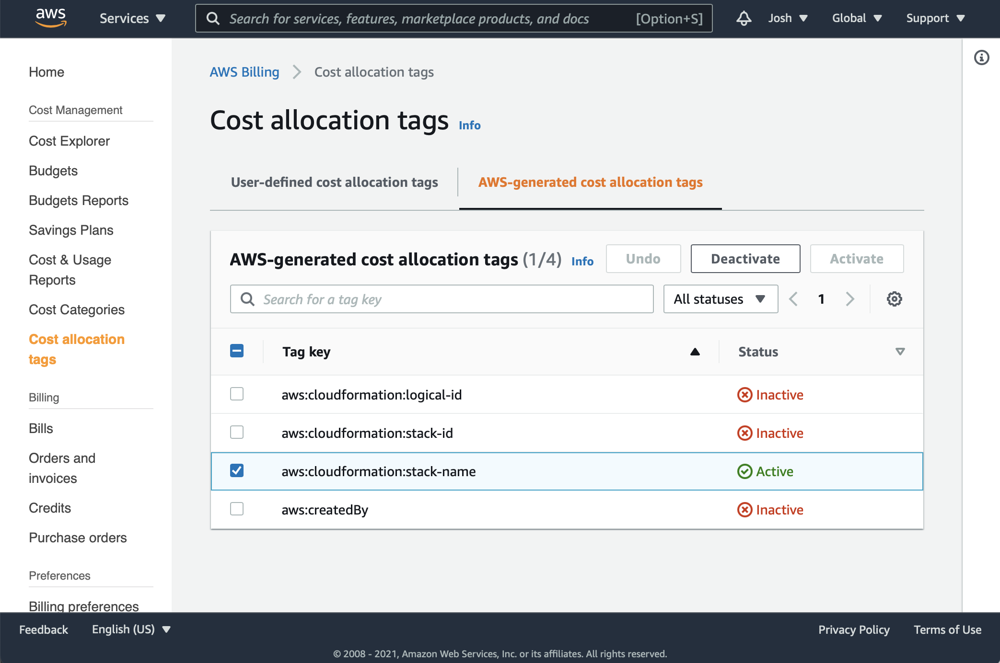

# Enderscraft

[](https://www.python.org/downloads/release/python-391/) [](https://github.com/psf/black) [](https://github.com/prettier/prettier) [](https://creativecommons.org/licenses/by-nc/4.0/)

## About

"Enderscraft" is Minecraft™ repackaged for on-demand serverless computing. Instead of running a server 24/7, run your server on-demand for pennies an hour in AWS. Only pay for the hours that you're actually playing.

### Features (in-progress or planned)

- Supports all mods and versions
- Deploy to any AWS Region
- Scaleable up to 4 vCPU and 30GB RAM
- Launchable via CLI or Discord bot
- Continuous snapshots with restore on resume
- Log/Telemetry streaming for monitoring
- Auto-DNS record creation in custom domain
- Tick fast-forward on resume
- RCON enabled
- Remote Debugging via JMX

### Pricing

Enderscraft is free as in beer but you can roughly approximate your AWS bill with the table below.
| per vCPU per hour | per GB of RAM per hour |
| ----------------- | ---------------------- |
| $0.01264791 | $0.00138883 |

You will also incur additional charges for things like: data transfer, log storage, container storage, lambdas, DNS queries, and volume backups. To keep costs under control, during the initial setup, a budget and alerts are created which will notify you at 50%, 75%, and 95% of your user-defined monthly allowance.

### Commerical Use

This software is not licensed for commerical use. If you're interested in using this code commercially, please contact: Josh Enders <<josh.enders@gmail.com>>.

## Getting Started

## Installation

Enderscraft is designed to run in AWS on so-called "serverless" infrastructure. To make deployment easier, a CloudFormation template is provided which will automatically create and configure the necessary services in AWS in a secure and cost effective manner.

## AWS Setup

### Dependencies

- [aws-cli](https://github.com/aws/aws-cli)

#### Environment

The following environment variables are required for the rest of the setup process.

```bash
export PROJECT_NAME="enderscraft"
export AWS_PAGER="cat"
```

#### Initial AWS CLI Configuration

(Optional) If you haven't already, setup your default (root) account with `aws configure`.

```bash
aws configure
```

You should see output similar to this:

```bash
AWS Access Key ID [********************]:
AWS Secret Access Key [********************]:
Default region name [us-east-1]:
Default output format [None]:
```

After successfully completing this process, you should have a `[default]` section in your `~/.aws/credentials` file.

### CloudFormation

#### Environment

The following environment variables are required for the rest of the setup process. Configure according to your preferences.

```bash
export AWS_REGION="$(aws configure get 'region')"
export CFN_DOMAIN="example.net"
export CFN_EMAIL_ADDRESS="you@example.com"
export CFN_ADMIN_CIDR="0.0.0.0/0"  # default: any
export CFN_MONTHLY_BUDGET_USD="10" # default: $10 USD
```

From the root directory of the project, create the CloudFormation stack.

```bash
aws cloudformation create-stack \
    --profile "default" \
    --region "${AWS_REGION}" \
    --stack-name "${PROJECT_NAME}" \
    --template-body "file://cloudformation/public_vpc.cfn.yaml" \
    --capabilities "CAPABILITY_NAMED_IAM" \
    --parameters \
        "ParameterKey=ParameterHostedZone,ParameterValue=${CFN_DOMAIN}" \
        "ParameterKey=ParameterEmailAddress,ParameterValue=${CFN_EMAIL_ADDRESS}" \
        "ParameterKey=ParameterAdminCIDR,ParameterValue=${CFN_ADMIN_CIDR}" \
        "ParameterKey=ParameterBudgetAmountUSD,ParameterValue=${CFN_MONTHLY_BUDGET_USD}"
```

(Optional) It is normal for cloudformation to take awhile. If you'd like some kind of indication of completion, you can run the following command which will block until the stack is available.

```bash
aws cloudformation wait stack-create-complete --stack-name "${PROJECT_NAME}"
```

### DNS

Once the stack has been created, you can run the following command to get the authoritative Route53 nameservers assigned to your domain.

```bash
aws cloudformation describe-stacks \
    --profile "default" \
    --stack-name "${PROJECT_NAME}" \
    --query 'Stacks[0].[Outputs[0].OutputValue,
                        Outputs[1].OutputValue,
                        Outputs[2].OutputValue,
                        Outputs[3].OutputValue]'
```

You can now login to your domain registrar's website and delegate your domain to Route53. Instructions on how to do this can be found on your registrar's website.

### Cost Allocation Tags

In order to get budget alerts working correctly, you need to enable CloudFormation's **_Cost allocation tags_**. Unfortunately there is no API for this. Head over to the [AWS Billing & Cost Management Dashboard](https://console.aws.amazon.com/billing/home?#/tags) and put a check in the column for the `aws:cloudformation:stack-name` row and then click **_Activate_**. It may take 24h for tags to be associated with resources in the dashboard.

> **_Warning:_** It is **very important** that you **do not forget this step** or else budget alerts will not work as expected.



### IAM Configuration

Create an access key for the `enderscraft` IAM user.

```bash
aws iam create-access-key --user-name "${PROJECT_NAME}"
```

Configure your IAM user with the credentials displayed by the previous step.

> **_Note:_** When prompted for `Default region name`, select a region that is network equidistant between all players.

```bash
aws --profile "enderscraft" configure
```

### Container Launch

#### Dependencies

- [fargatecli](https://github.com/awslabs/fargatecli)

#### Environment

The following environment variables are required for the rest of the setup process.

```bash
export AWS_ACCOUNT_ID="$(aws sts get-caller-identity --profile 'default' --output 'text' --query 'Account')"
export AWS_SUBNET_ID="$(aws ec2 describe-subnets --profile 'default' --output 'text' --filters "Name=tag:Name,Values=${PROJECT_NAME}-SubnetPublic" --query 'Subnets[0].SubnetId')"
export AWS_SECURITY_GROUP_ID="$(aws ec2 describe-security-groups --profile 'default' --output 'text' --filters "Name=tag:Name,Values=${PROJECT_NAME}-SecurityGroupFargateTasks" --query 'SecurityGroups[0].GroupId')"
```

Containers can be launched with `fargatecli` with the following command.

> **Note:** `--cpu` and `--memory` can be tuned as desired

```bash
AWS_PROFILE="${PROJECT_NAME}" \
fargate task run \
    "${PROJECT_NAME}" \
        --subnet-id "${AWS_SUBNET_ID}" \
        --security-group-id "${AWS_SECURITY_GROUP_ID}" \
        --env "ACCEPT_EULA=yes" \
        --cpu "2048" \
        --memory "4096" \
        --image "${AWS_ACCOUNT_ID}.dkr.ecr.${AWS_REGION}.amazonaws.com/enderscraft:latest"
```

#### Common ECS Repository Maintenance Tasks

Delete an image by tag:

```bash
aws ecr batch-delete-image \
    --profile "default" \
    --repository-name "${PROJECT_NAME}" \
    --image-ids imageTag="latest"
```

Delete an image by digest:

```bash
aws ecr batch-delete-image \
    --profile "default" \
    --repository-name "${PROJECT_NAME}" \
    --image-ids imageDigest="sha256:ea38a89e..."
```

## Contributing

### Style

- [black](https://github.com/psf/black)
- [cfn-lint](https://github.com/aws-cloudformation/cfn-python-lint)
- [prettier](https://github.com/prettier/prettier)
- [shellcheck](https://github.com/koalaman/shellcheck)

### Directory structure

```bash
.
├── cloudformation         # AWS CloudFormation files
├── doc                    # Supporting files for Documentation
├── docker                 # Docker files
│   ├── alpine             # WIP Alpine-based containers
│   └── debian             # Debian-based containers
│       ├── base-corretto  # Base layer build context
│       │   └── files      # Base layer root filesystem overlay
│       └── enderscraft    # Minecraft layer build context
│           └── files      # Minecraft layer root filesystem overlay
├── src                    # Build scripts and whatnot
└── tests                  # Hopes and dreams
```

## License

This work is licensed under CC BY-NC version 4.0 [https://creativecommons.org/licenses/by-nc/4.0/](https://creativecommons.org/licenses/by-nc/4.0/)
© 2020, Josh Enders. Some Rights Reserved.
